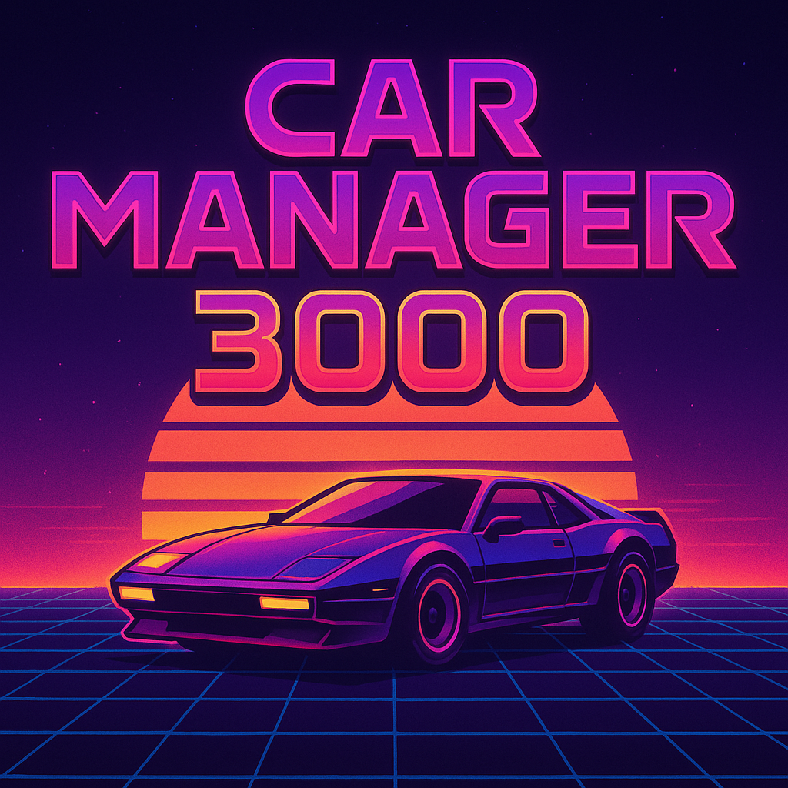

Car Manager brings all your fleet information together: Vehicle details, maintenance history, documents, and fuel usage.
Stay on top of every oil change and tire rotation with smart reminders.
When it’s time to sell, export professional reports that give buyers confidence.

  

## Development

<details open>
<summary>
Pre-requisites
</summary> <br />
    Car Manager 3000 is using  <a href="https://bun.com/">Bun</a> as package manager and runtime.
    To start developing you will need:

###

- Git
- Bun

</details>

<details open>
<summary>
Stack
</summary> <br />

### Backend

- [Bun](https://bun.sh/) - Runtime
- [Hono](https://hono.dev/) - Web framework
- [oRPC](https://orpc.io/) - Type-safe RPC
- [Drizzle ORM](https://orm.drizzle.team/) - Database ORM
- [Zod](https://zod.dev/) - Schema validation
- [Swagger UI](https://swagger.io/tools/swagger-ui/) - API documentation

### Frontend

- [React 19](https://react.dev/) - UI framework
- [Vite](https://vitejs.dev/) - Build tool
- [TanStack Router](https://tanstack.com/router) - Routing
- [TanStack Query](https://tanstack.com/query) - Data fetching & state
- [TanStack Form](https://tanstack.com/form) - Forms
- [TanStack Table](https://tanstack.com/table) - Tables
- [Tailwind CSS](https://tailwindcss.com/) - Styling
- [Lucide React](https://lucide.dev/) - Icons

</details>

To install dependencies:

```sh
bun install
```

To run:

```sh
bun run dev
```

Open <http://localhost:5173> in your browser.
